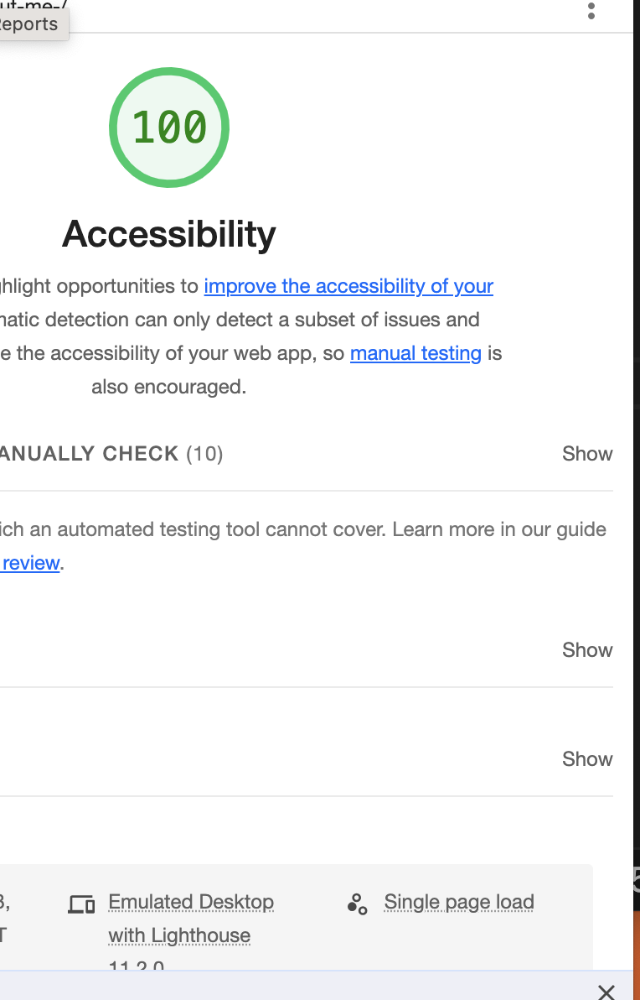

# LAB - 02

## Readme

I build an app with a direct and powerful purpose. It does all of the things that it accomplishes well. I should describe the purpose and functionality so those that visit my README understand the app

 Author: Lisa

201 Lab Links:

*    http://127.0.0.1:5500/about-me-/index.html

*   http://127.0.0.1:5500/reading-notes/102/reading02.md

* [submission PR](http://xyz.com)
* Any Links you used as reference

### Lighthouse Accessibility Report Score # 100

* Provide a screenshot of your score after running a Lighthouse Accessibility report.

### Reflections and Comments

* Consider including the answers to your daily journal and submission questions here
* This is also a good place to reflect on the tools and resources used and learned
